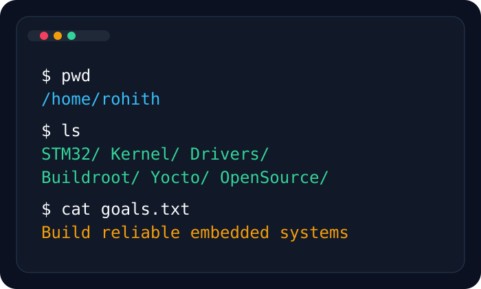
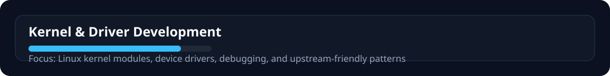
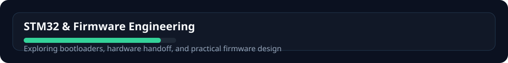
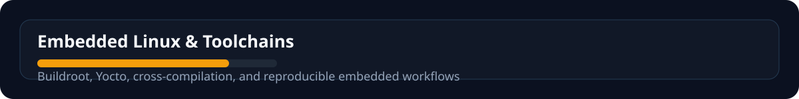
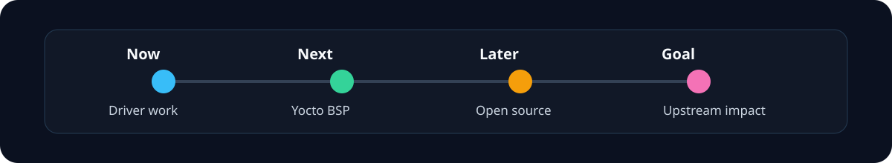

<div align="center">
  
  
</div>

<p align="center">
  <a href="https://github.com/rohith0210">
    
  </a>
  <a href="https://rohith-portfolio-es.vercel.app/">
    
  </a>
  <a href="https://www.linkedin.com/in/rohith-chidurala-b38b26287/">
    
  </a>
</p>

<table width="100%" cellspacing="20">
  <tr>
    <td valign="top" width="55%">

### About Me

I build low-level software for embedded systems with a focus on Linux, kernel modules, device drivers, firmware, and reproducible build environments. My work spans STM32 bootloaders, character drivers, and embedded Linux stacks powered by Buildroot and Yocto.

- Current mission: build reliable firmware and driver experiments for real hardware
- Focus areas: kernel internals, device trees, cross-build CI, and upstream-friendly code
- Goal: grow into a strong embedded Linux engineer and contribute meaningful open-source work

    </td>
    <td valign="top" width="45%">

### Terminal



    </td>
  </tr>
</table>

<p align="center">
  
</p>

### Engineering Dashboard

<p align="center">
  
  &nbsp;&nbsp;
  
</p>

<p align="center">
  
</p>

<p align="center">
  
</p>

### Current Mission

<p align="center">
  
</p>

<p align="center">
  
</p>

<p align="center">
  
</p>

<p align="center">
  
</p>

<p align="center">
  
</p>

### Featured Projects

<table width="100%" cellspacing="12">
  <tr>
    <td valign="top" width="25%">
      <strong><a href="https://github.com/rohith0210?tab=repositories">STM32 Bootloader</a></strong>
      <p>Bootloader work for STM32 with serial flashing and reliability-focused firmware updates.</p>
    </td>
    <td valign="top" width="25%">
      <strong><a href="https://github.com/rohith0210?tab=repositories">linux-kmod-example</a></strong>
      <p>Kernel module experiments and user-space harnesses for learning device-driver behavior.</p>
    </td>
    <td valign="top" width="25%">
      <strong><a href="https://github.com/rohith0210?tab=repositories">buildroot-experiments</a></strong>
      <p>Embedded Linux build experiments around minimal root filesystems and package integration.</p>
    </td>
    <td valign="top" width="25%">
      <strong><a href="https://github.com/rohith0210?tab=repositories">yocto-playground</a></strong>
      <p>Yocto layer and BSP exploration for integrating custom board support into embedded images.</p>
    </td>
  </tr>
</table>

<p align="center">
  
</p>

<p align="center">
  
</p>

### Engineering Toolkit

<p align="center">
  
</p>

<p align="center">
  
</p>

### Quick Terminal

```bash
$ whoami
rohith

$ uname -a
Linux devbox 6.8.x #1 SMP PREEMPT_DYNAMIC

$ ls
STM32/  Kernel/  Drivers/  Buildroot/  Yocto/  OpenSource/
```

<p align="center">
  
</p>

### Connect

- Portfolio: https://rohith-portfolio-es.vercel.app/
- LinkedIn: https://www.linkedin.com/in/rohith-vinay-8276a33a2
- GitHub: https://github.com/rohith0210
- Email: add your contact email here if you want it visible

<p align="center">Embedded Linux • Kernel • Device Drivers • STM32 • Buildroot • Yocto • Open Source</p>
