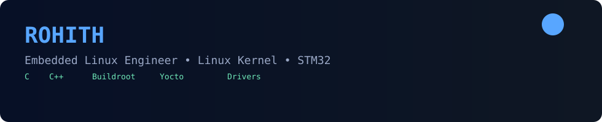
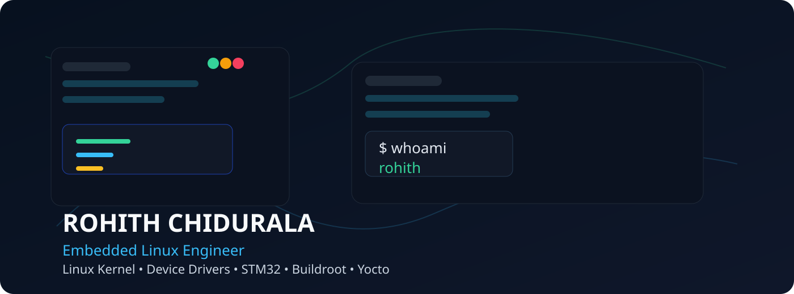

# Rohith Chidurala — Embedded Linux Engineer (rohith0210)

<p align="center">
  
</p>

<p align="center">
  
</p>

---

## About

I build low-level software for embedded systems: kernel modules, device drivers, and firmware. Focused on STM32, Buildroot, Yocto, and contributing to the Linux kernel.

<p align="left">
  
  &nbsp;&nbsp;
  
</p>

---

## Engineering Dashboard

- Current mission: Linux character driver + upstream patchset
- Building: STM32 bootloader (UART / XMODEM), kernel modules
- Learning: Yocto BSPs, upstream kernel contribution process

<p align="center">
  
</p>

---

## Featured projects

- **STM32 Bootloader** — field-updatable bootloader for STM32 (serial flashing)
- **linux-kmod-example** — kernel module + userspace test harness
- **buildroot-experiments** — tiny images for embedded testing
- **Secure Node** — IoT / ESP32 experiments

(See pinned repositories below)

---

## Open Source Activity

<p align="center">
  
  &nbsp;
  
</p>

---

## Terminal — quick dev preview

```bash
$ whoami
rohith

$ uname -a
# Linux (dev machine / CI container)

$ ls
STM32/  kernel/  drivers/  buildroot/  yocto/# Rohith Chidurala — Embedded Linux Engineer (rohith0210)



<p align="center">
  
</p>

────────────────────────────────────

Minimal introduction
- Who: Rohith Chidurala — Embedded Linux & Systems Software engineer in training.
- Focus: kernel internals, device drivers, firmware, Buildroot/Yocto BSPs.
- Approach: hardware-first, test-driven, reproducible builds and CI.

────────────────────────────────────

Engineering Dashboard
- Current Project: STM32 Bootloader (firmware + alternative transport)
- Current Mission: Build Linux character driver & upstream patches
- Learning: Platform driver internals, Yocto BSPs
- Open Source: seeking first kernel upstream contribution to a device tree binding

Live quick-glance panels:
<p align="center">
  
  
</p>

────────────────────────────────────

Currently Building
- STM32 Bootloader — UART / XMODEM updates, secure handoff (firmware)
- Linux Kernel Modules — character driver + udev integration (kernel)
- Buildroot Experiments — minimal images for STM32-based SBCs (buildroot)
- Yocto BSP — plan for layer that supports custom board (yocto)
- Open Source — prepare a kernel patch set for upstream review

────────────────────────────────────

Engineering Toolkit

Languages
- C, C++, Python, Bash

Embedded
- STM32 (HAL/LL), ARM Cortex-M, bare-metal, OpenOCD

Linux
- Kernel modules, device drivers, device tree, Buildroot, Yocto

Tools
- Git, Make, CMake, QEMU, GDB, Docker, CI (GitHub Actions)

────────────────────────────────────

Featured Projects (short)
### STM32 Bootloader
A field-updatable bootloader for STM32 with serial flashing and CRC checks.
Tech: C, STM32 HAL, OpenOCD, Make — Status: active

### linux-kmod-example
Example kernel module + userspace test harness to demonstrate a character device.
Tech: C, Linux kernel modules — Status: maintenance / upstream-ready

### buildroot-experiments
Personal Buildroot configs and packages for tiny images used in testing.
Tech: Buildroot, BusyBox, cross-compilation — Status: evolving

(Replace the repo names above to show real pinned stats and images)

────────────────────────────────────

Engineering Roadmap
- Now: complete kernel module + test suite
- 3 months: upstream one driver patch and add CI for cross-builds
- 6–12 months: Yocto BSP + public examples and guides

────────────────────────────────────

Open Source Activity
<p align="center">
  
  &nbsp;
  
</p>

────────────────────────────────────

Terminal — quick developer preview
```bash
$ whoami
rohith

$ uname -a
# Linux (dev machine / CI container)

$ ls projects
STM32/      kernel/      buildroot/    yocto/    drivers/

$ cat goals.txt
Become an Embedded Linux Engineer