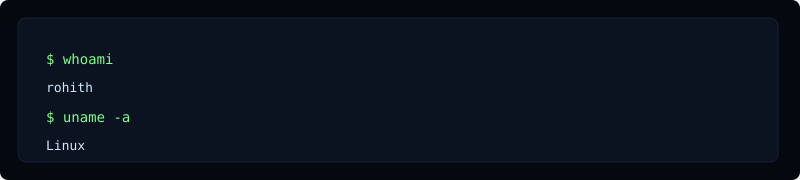

<p align="center">
  
</p>

<table width="100%" cellspacing="20">
  <tr>
    <td valign="top" width="55%">

### About

I build low-level software for embedded systems: kernel modules, device drivers, and firmware. My focus areas are STM32, Buildroot, Yocto, and upstream Linux kernel contributions.

- Current: STM32 bootloader (UART / XMODEM) and Linux character driver
- Interested in: Kernel internals, device trees, cross-build CI
- Goal: upstream device driver contributions

    </td>
    <td valign="top" width="45%">

### Terminal



    </td>
  </tr>
</table>

<p align="center">
  
</p>

### Engineering Dashboard

<p align="center">
  
  &nbsp;&nbsp;
  
</p>

<p align="center">
  
</p>

<p align="center">
  
</p>

### Featured projects

<table width="100%" cellspacing="12">
  <tr>
    <td valign="top" width="33%">
      <strong><a href="/rohith0210/STM32-Bootloader">STM32 Bootloader</a></strong>
      <p>Field-updatable bootloader for STM32 with serial flashing and CRC checks.</p>
    </td>
    <td valign="top" width="33%">
      <strong><a href="/rohith0210/linux-kmod-example">linux-kmod-example</a></strong>
      <p>Example kernel module + userspace test harness to demonstrate a character device.</p>
    </td>
    <td valign="top" width="33%">
      <strong><a href="/rohith0210/buildroot-experiments">buildroot-experiments</a></strong>
      <p>Personal Buildroot configs and packages for tiny test images and CI.</p>
    </td>
  </tr>
</table>

<p align="center">
  
</p>

### Open Source Activity

<p align="center">
  
</p>

<p align="center">
  
</p>

### Quick terminal

```bash
$ whoami
rohith

$ uname -a
# Linux (dev / CI)

$ ls
STM32/  kernel/  drivers/  buildroot/  yocto/
```

<p align="center">
  
</p>

### Connect

- LinkedIn: https://www.linkedin.com/in/rohith-vinay-8276a33a2
- Email: (add contact email if you want it shown)

<p align="center">*Profile: Embedded Linux • Kernel • Drivers • STM32 • Buildroot • Yocto*</p>
